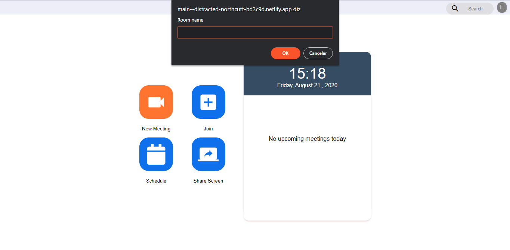
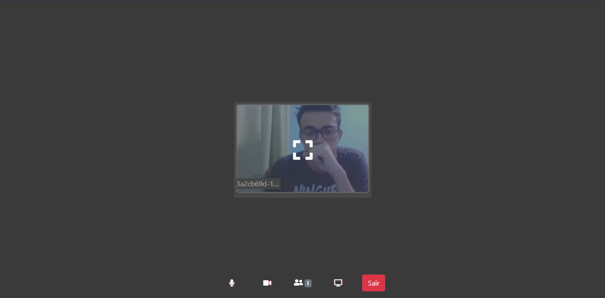

# Google Meet Clone

Google Meet clone. WebRTC Study

## Instructions

Install project dependencies

```bash
  cd public
  npm i
```

```bash
  cd server
  npm i
```

```bash
  cd peer-server
  npm i
```

Run the projects

```bash
  cd public
  npm run start
```

```bash
  cd server
  npm run dev
```

```bash
  cd peer-server
  npm run dev
```

## images

Home


Room

